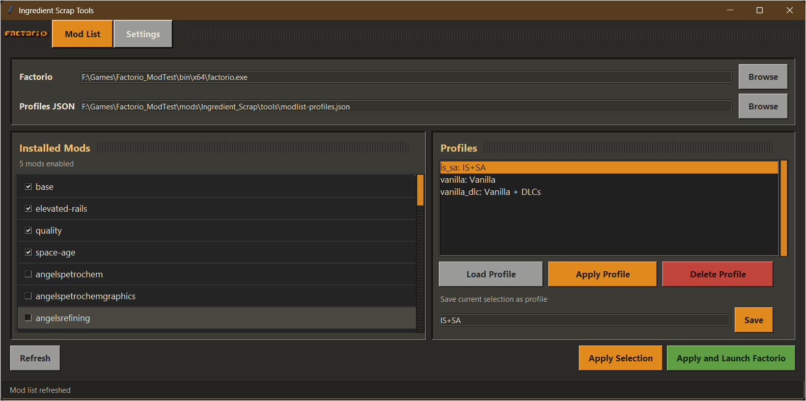
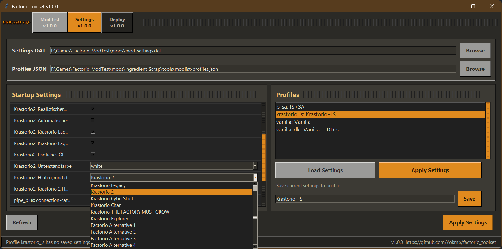

# Factorio Toolset

Small Tkinter tool shell for managing local Factorio convenience tools.

Version: 1.0.0  
GitHub: https://github.com/Yokmp/factorio_toolset

## Screenshots





## Included Tools

- Mod List: enable/disable installed mods, save mod selections as profiles, apply a profile, and optionally launch Factorio.
- Settings: inspect and edit startup settings from `mod-settings.dat`, then save them into the same profile file.

Future ideas are tracked in [`TOOLS_ROADMAP.md`](TOOLS_ROADMAP.md).

## Requirements

- Python 3 with Tkinter
- A local Factorio installation

No external Python packages are required.

## Files To Package

Required:

- `ui.py`
- `modlist.py`
- `settings.py`

Optional but recommended:

- `README.md`
- `README.json`
- `TOOLS_ROADMAP.md`
- `screenshots/`

Generated locally:

- `modlist-profiles.json`
- `tool-ui.json`

The generated JSON files store user profiles, paths, window size, and the last selected profile. They do not need to be shipped.

## Start

From inside the tool folder:

```powershell
python ui.py
```

Or from the repository root:

```powershell
python tools/ui.py
```

On first use, select the Factorio executable and the relevant Factorio settings/profile paths with the Browse buttons.

## Profiles

The built-in profiles are:

- `vanilla`
- `vanilla_dlc`

Custom profiles are written to `modlist-profiles.json`. The same profile can contain both enabled mods and startup settings.

## CLI

The mod list tool can also be used directly:

```powershell
python modlist.py --last
```

`--last` applies the last profile and launches Factorio. If no last profile exists, it falls back to `vanilla_dlc` when Space Age is installed, otherwise `vanilla`.
