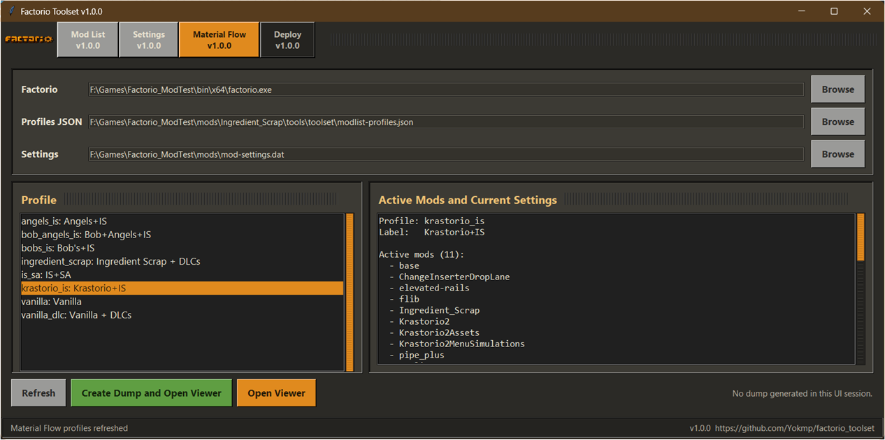
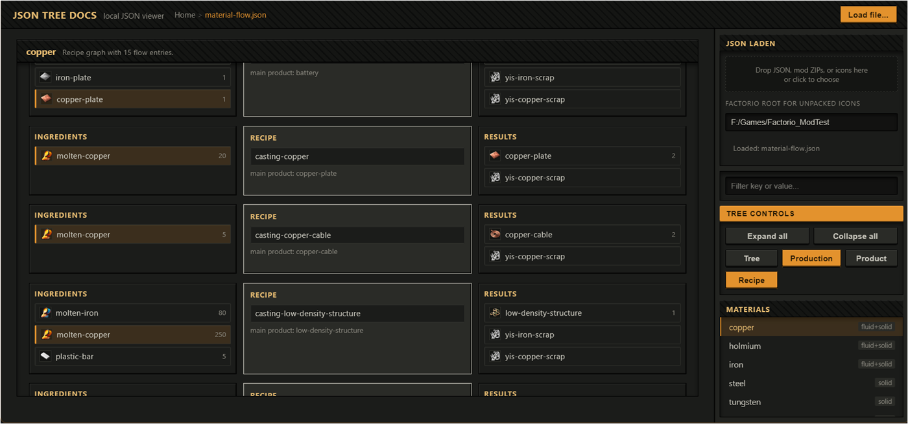

# Factorio Toolset

Small Tkinter tool shell for managing local Factorio convenience tools.

The toolset is intended to be path independent: keep the toolset files together in one folder, then use the Browse buttons or CLI options to point it at `factorio.exe`, profile JSON, and `mod-settings.dat`.

Version: 1.0.0  
GitHub: https://github.com/Yokmp/factorio_toolset

## Screenshots

| ui.py | json-tree-viewer |
| :-: | :-: |
| <br><br> |  |

## Included Tools

- Mod List: enable/disable installed mods, save mod selections as profiles, apply a profile, and optionally launch Factorio.
- Settings: inspect and edit startup settings from `mod-settings.dat`, then save them into the same profile file.
- Material Flow: run the Ingredient Scrap test harness for a selected mod profile, generate `material-flow.json`, and open it in the browser viewer.
- JSON Tree Viewer: inspect any JSON file as a collapsible tree, or inspect Ingredient Scrap material-flow data as a production/recipe graph.

Future ideas are tracked in [`TOOLS_ROADMAP.md`](TOOLS_ROADMAP.md).

Material Flow dump integration details are documented in [`MATERIAL_FLOW.md`](MATERIAL_FLOW.md).

## Requirements

- Python 3 with Tkinter
- A local Factorio installation

No external Python packages are required.

## Files To Package

Required:

- `ui.py`
- `modlist.py`
- `settings.py`
- `material_flow.py`
- `json-tree-viewer.html`
- `treeview-example.json`

Optional but recommended:

- `README.md`
- `MATERIAL_FLOW.md`
- `TOOLS_ROADMAP.md`
- `material_flow_list.py`
- `screenshots/`

Ingredient Scrap local integration:

- `../test/` for the Factorio dump/test runner helpers used by `material_flow.py`.

Generated locally:

- `modlist-profiles.json`
- `tool-ui.json`
- Factorio `script-output/Ingredient_Scrap/material-flow.json`
- Factorio `script-output/Ingredient_Scrap/material-flow-data.js`
- Factorio `script-output/Ingredient_Scrap/icon-assets/`

The generated JSON files store user profiles, paths, window size, and the last selected profile. The `script-output` files are generated by Factorio/test runs and do not need to be shipped.

## Start

From inside the tool folder:

```powershell
python ui.py
```

Or from the repository root:

```powershell
python tools/toolset/ui.py
```

On first use, select the Factorio executable and the relevant Factorio settings/profile paths with the Browse buttons.

## Profiles

The built-in profiles are:

- `vanilla`
- `vanilla_dlc`

Custom profiles are written to `modlist-profiles.json`. The same profile can contain both enabled mods and startup settings.

## Material Flow Viewer

The Material Flow tab creates an Ingredient Scrap debug dump by running the test harness. It writes:

- `material-flow.json`: readable JSON data for the viewer.
- `material-flow-data.js`: same data wrapped as a browser-loadable state script.
- `icon-assets/`: extracted ZIP icons used by the viewer when a mod is packaged as a zip.

The UI opens the viewer with:

```text
json-tree-viewer.html?file=<path-to-material-flow.json>&state=<path-to-material-flow-data.js>
```

The viewer first tries to load `file`. If the browser blocks direct local JSON loading, it falls back to `state`.

You can open the viewer manually with:

```text
json-tree-viewer.html?file=treeview-example.json
```

or with an absolute path:

```text
json-tree-viewer.html?file=F:/Games/Factorio_ModTest/script-output/Ingredient_Scrap/material-flow.json
```

The viewer also accepts the older query parameters `json=` and `state=` for compatibility.

For command-line dump generation without the full assertion report, use:

```powershell
python tools\toolset\material_flow.py --mod-profile vanilla_dlc --dump-profile default --open-viewer
```

This launches Factorio once, creates a temporary save, enriches `material-flow.json` with icon metadata, and optionally opens the viewer.

### Flow JSON Shape

Tree mode accepts any JSON. Production mode expects:

```json
{
  "schema": "ingredient-scrap-material-flow/v1",
  "flows": [
    {
      "material": "prefix-example",
      "recipe": {
        "name": "test-prefix-example-mixed",
        "main_product": "prefix-example-product-mixed"
      },
      "ingredients": [],
      "results": []
    }
  ]
}
```

Icon lookup order for ingredients/results:

```js
entry.icon
entry.prototype.icon
entry.result.prototype.icon
```

An icon is displayed when it has a `url`, or when the viewer can resolve `path`/`source` through `asset_roots`, loaded ZIPs, dropped image files, or the configured Factorio root.

## CLI

The mod list tool can also be used directly:

```powershell
python modlist.py --last
```

`--last` applies the last profile and launches Factorio. If no last profile exists, it falls back to `vanilla_dlc` when Space Age is installed, otherwise `vanilla`.

The Ingredient Scrap test harness can be run directly from the repository root:

```powershell
python tools\test\run_tests.py --profile default --no-color
```

To generate only `material-flow.json` without printing the test assertion report:

```powershell
python tools\toolset\material_flow.py --mod-profile vanilla_dlc --dump-profile default
```

For mod profile testing:

```powershell
python tools\test\run_tests.py --mod-profile vanilla_dlc --profile default --no-color
```
