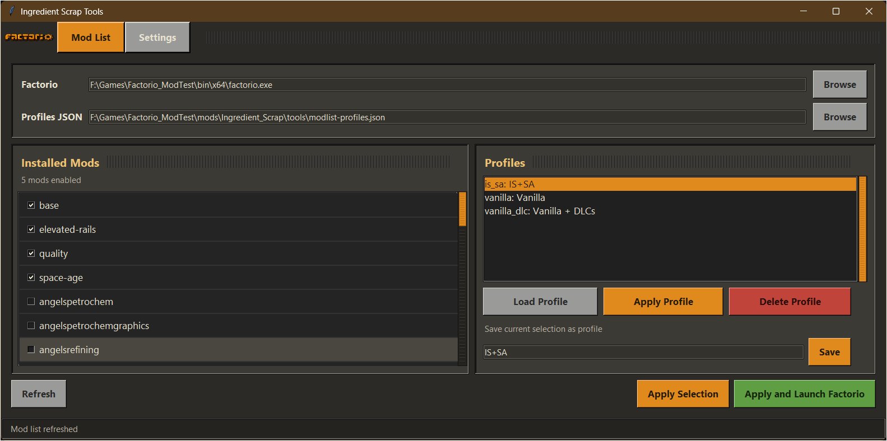
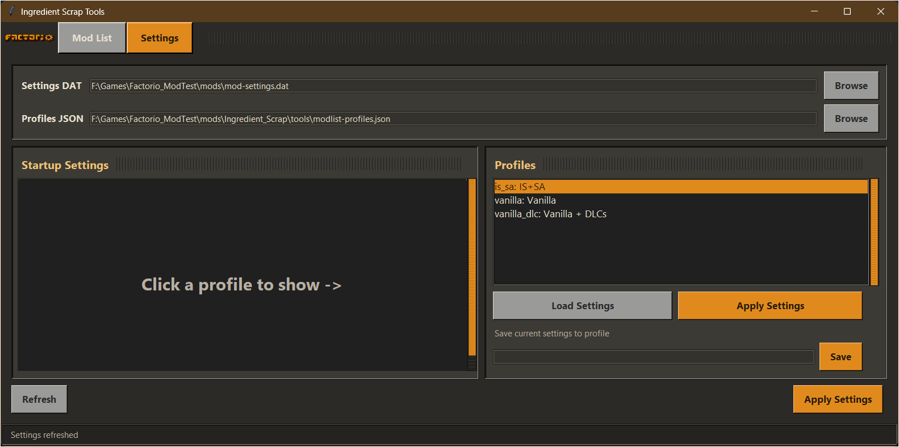
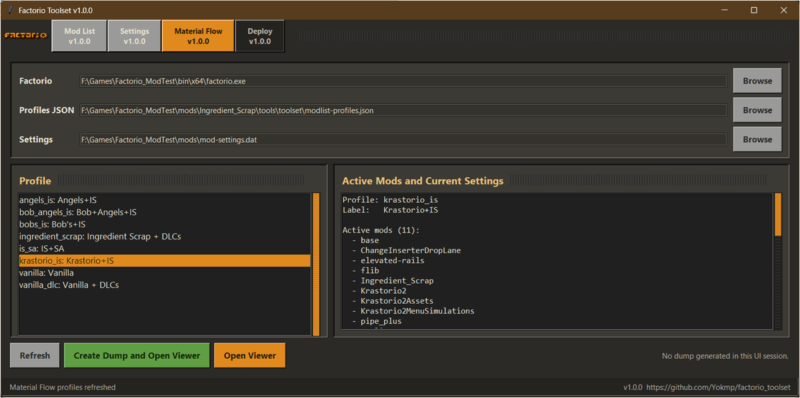
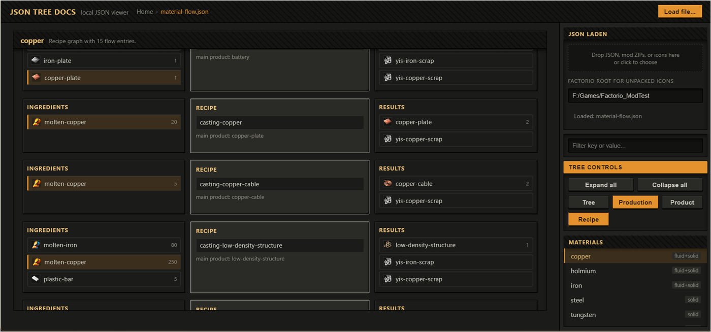

# Factorio Toolset

Small Tkinter tool shell for managing local Factorio convenience tools.

The toolset is intended to be path independent: keep the toolset files together in one folder, then use the Browse buttons or CLI options to point it at `factorio.exe`, profile JSON, and `mod-settings.dat`.

Version: 1.0.1  
GitHub: https://github.com/Yokmp/factorio_toolset

The current workspace layout keeps the UI and the generic Factorio test runner
outside the individual mods:

```text
Toolsets/
|-- factorio-toolset/
`-- testharness/
```

Individual mods still own their Factorio-side test files under `tools/test/`.
Unless stated otherwise, the commands below are run from the `Toolsets`
directory shown above.

## Screenshots

| ui.py | json-tree-viewer |
| :-: | :-: |
| <br><br> |  |

## Included Tools

- Mod List: enable/disable installed mods, save mod selections as profiles, apply a profile, and optionally launch Factorio.
- Settings: inspect and edit startup settings from `mod-settings.dat`, then save them into the same profile file.
- Material Flow: run the Ingredient Scrap test harness for a selected mod profile, generate `material-flow.json`, and open it in the browser viewer.
- Ancestry Flow (CLI): read existing Ingredient Scrap dumps and build a passive
  ancestry-vs-current comparison without launching Factorio.
- Debug: run common Ingredient Scrap test-harness commands from the UI and
  capture their output in the tool window.
- Deploy: build filtered Factorio mod release archives and optionally publish
  `public.zip` to a Git branch.
- JSON Tree Viewer: inspect any JSON file as a collapsible tree, or inspect Ingredient Scrap material-flow data as a production/recipe graph.

Future ideas are tracked in [`TOOLS_ROADMAP.md`](TOOLS_ROADMAP.md).

Material Flow dump integration details are documented in [`MATERIAL_FLOW.md`](MATERIAL_FLOW.md).

## Requirements

- Python 3 with Tkinter
- A local Factorio installation

No external Python packages are required.

## Files To Package

Required:

- `ui.py`
- `modlist.py`
- `settings.py`
- `material_flow.py`
- `ancestry_flow.py`
- `deploy.py`
- `json-tree-viewer.html`
- `treeview-example.json`

Optional but recommended:

- `README.md`
- `MATERIAL_FLOW.md`
- `TOOLS_ROADMAP.md`
- `screenshots/`

Test-harness integration:

- `../testharness/` contains the generic runner used by `material_flow.py` and
  the Debug tab.
- The selected mod supplies its own `tools/test/harness.json` and Lua test files.

Generated locally:

- `modlist-profiles.json`
- `tool-ui.json`
- Factorio `script-output/Ingredient_Scrap/material-flow.json`
- Factorio `script-output/Ingredient_Scrap/material-flow-data.js`
- Factorio `script-output/Ingredient_Scrap/production-flow.json`
- Factorio `script-output/Ingredient_Scrap/production-flow-data.js`
- Factorio `script-output/Ingredient_Scrap/icon-assets/`

The generated JSON files store user profiles, paths, window size, and the last selected profile. The `script-output` files are generated by Factorio/test runs and do not need to be shipped.

## Start

From inside the tool folder:

```powershell
python ui.py
```

Or from the `Toolsets` directory:

```powershell
python factorio-toolset\ui.py
```

On first use, select the Factorio executable and the relevant Factorio settings/profile paths with the Browse buttons.

## Profiles

The built-in profiles are:

- `vanilla`
- `vanilla_dlc`

Custom profiles are written to `modlist-profiles.json`. The same profile can contain both enabled mods and startup settings.

## Material Flow Viewer

The Material Flow tab creates an Ingredient Scrap debug dump by running the test harness. It writes:

- `material-flow.json`: readable JSON data for the viewer.
- `material-flow-data.js`: same data wrapped as a browser-loadable state script.
- `production-flow.json`: neutral recipe/item/fluid graph for broader
  production-chain review.
- `production-flow-data.js`: same production graph wrapped as a state script.
- `icon-assets/`: extracted ZIP icons used by the viewer when a mod is packaged as a zip.

The unprofiled `material-flow.json` and `production-flow.json` files are always
the latest run. Profile-specific copies such as
`material-flow-angels_full_is.json` are written next to them and are better for
comparisons between mod sets. If the latest run used `angels_full_is`,
`material-flow.json` and `material-flow-angels_full_is.json` will be identical
by design.

The UI opens the viewer with:

```text
json-tree-viewer.html?file=<path-to-material-flow.json>&state=<path-to-material-flow-data.js>
```

The viewer first tries to load `file`. If the browser blocks direct local JSON loading, it falls back to `state`.

You can open the viewer manually with:

```text
json-tree-viewer.html?file=treeview-example.json
```

or with an absolute path:

```text
json-tree-viewer.html?file=F:/Games/Factorio_ModTest/script-output/Ingredient_Scrap/material-flow.json
```

The viewer also accepts the older query parameters `json=` and `state=` for compatibility.

For command-line dump generation without the full assertion report, use:

```powershell
python factorio-toolset\material_flow.py --mod-root ..\Ingredient_Scrap --mod-profile vanilla_dlc --dump-profile default --open-viewer
```

This launches Factorio once, creates a temporary save, enriches `material-flow.json` with icon metadata, and optionally opens the viewer.

### Flow JSON Shape

Tree mode accepts any JSON. Production mode expects:

```json
{
  "schema": "ingredient-scrap-material-flow/v1",
  "flows": [
    {
      "material": "prefix-example",
      "recipe": {
        "name": "test-prefix-example-mixed",
        "main_product": "prefix-example-product-mixed"
      },
      "ingredients": [],
      "results": []
    }
  ]
}
```

Icon lookup order for ingredients/results:

```js
entry.icon
entry.prototype.icon
entry.result.prototype.icon
```

An icon is displayed when it has a `url`, or when the viewer can resolve `path`/`source` through `asset_roots`, loaded ZIPs, dropped image files, or the configured Factorio root.

## CLI

The mod list tool can also be used directly:

```powershell
python modlist.py --last
```

`--last` applies the last profile and launches Factorio. If no last profile exists, it falls back to `vanilla_dlc` when Space Age is installed, otherwise `vanilla`.

The Ingredient Scrap test harness can be run directly from the `Toolsets`
directory:

```powershell
python testharness\run_tests.py --mod-root ..\Ingredient_Scrap --profile default --no-color
```

The same common commands are available in the UI under the Debug tab. It includes
buttons for default, all profiles, selected mod profiles, and a custom argument
field for ad-hoc `run_tests.py` arguments.

To generate a configured JSON dump without printing the test assertion report:

```powershell
python factorio-toolset\material_flow.py --mod-root ..\Ingredient_Scrap --mod-profile vanilla_dlc --dump-profile default
```

`material_flow.py` reads the selected mod's `tools/test/harness.json` when
available. It opens the configured `material-flow.json` by default, then the
first configured JSON artifact, then `test-report.json`.

To build an offline ancestry comparison from archived dumps:

```powershell
python factorio-toolset\ancestry_flow.py --dump-dir ..\Ingredient_Scrap\tools\toolset\dumps --profile bob_angels_full_is
```

This reads `tools/toolset/dumps/<profile>/material-flow.json` and
`production-flow.json`, then writes `ancestry-flow.json` next to them. It does
not launch Factorio and does not change mod behavior. The output compares the
current generated scrap material for each flow with the ancestry-derived base
material composition.

Use `--root-policy resources` to build an alias-free baseline that only stops at
mined resource results:

```powershell
python factorio-toolset\ancestry_flow.py --dump-dir ..\Ingredient_Scrap\tools\toolset\dumps --profile krastorio_is --root-policy resources
```

This writes `ancestry-flow-resources.json`. The default `current` policy uses
the current Material Flow roots and aliases as stop markers. Use
`--root-policy hybrid` for the intended long-term comparison shape: stable
materials stop, while exact component aliases keep resolving through producer
recipes. It writes `ancestry-flow-hybrid.json`.

`--mixed-limit` controls the simulated effective output width. The default is
`3`: ancestry with more than three material families becomes `yis-mixed-scrap`
in the `effective_output` field, while narrower ancestry stays direct. This is
still a passive simulation and does not generate prototypes.

Add `--write-reviews` to write Markdown review helpers next to the ancestry
JSON:

```powershell
python factorio-toolset\ancestry_flow.py --dump-dir ..\Ingredient_Scrap\tools\toolset\dumps --profile bob_angels_full_is --root-policy hybrid --mixed-limit 3 --write-reviews
```

This regenerates the hybrid comparison review, decision groups, mixed-limit
simulation, and effective-output preview from the same input JSON files.

## Deploy

The deploy tool is path independent. In the external Toolsets layout, pass the
Factorio mod root explicitly:

```powershell
python factorio-toolset\deploy.py check --mod-root ..\Wood_Gasification_updated
```

In the Toolset UI, the Deploy tab scans direct subdirectories of the Factorio
`mods` directory for source mods containing a valid `info.json`. Select a mod
from the **Target Mod** list to see its title, internal name, versions, author,
dependencies, source path, and description. Refresh repeats the scan; Browse
can select a source mod outside the detected `mods` directory. Every Deploy
command automatically receives the selected directory as `--mod-root`, and the
selection is saved as the shared Toolset mod root. The Deploy tab intentionally
starts without a selected target so a build cannot accidentally use a mod chosen
in another Toolset tab or an earlier session.

Build release archives:

```powershell
python factorio-toolset\deploy.py build --mod-root ..\Wood_Gasification_updated
```

This writes both release files under `<mod-root>/_release_/`:

- `<internal-name>_<version>.zip` for the Mod Portal.
- `public.zip` for a clean public source branch.

The tool does not copy anything into Factorio/mods. Use `ensure-gitignore` to
make sure `_release_` stays local:

```powershell
python factorio-toolset\deploy.py ensure-gitignore --mod-root ..\Wood_Gasification_updated
```

To publish the public source ZIP to Git without switching the current branch:

```powershell
python factorio-toolset\deploy.py publish-public --mod-root ..\Wood_Gasification_updated --dry-run
python factorio-toolset\deploy.py publish-public --mod-root ..\Wood_Gasification_updated --build-first
python factorio-toolset\deploy.py publish-public --mod-root ..\Wood_Gasification_updated --branch public
```

The default publish target is `main`; `--branch` can publish to another branch.
Publishing uses a temporary Git worktree under `_release_` and removes it again.
In the UI, Check, Build and Clean are followed by a compact Git section:
Gitignore and Publish share one row, while the branch and publish options are
shown directly below them. Dry run is enabled by default.

For mod profile testing:

```powershell
python testharness\run_tests.py --mod-root ..\Ingredient_Scrap --mod-profile vanilla_dlc --profile default --no-color
```
